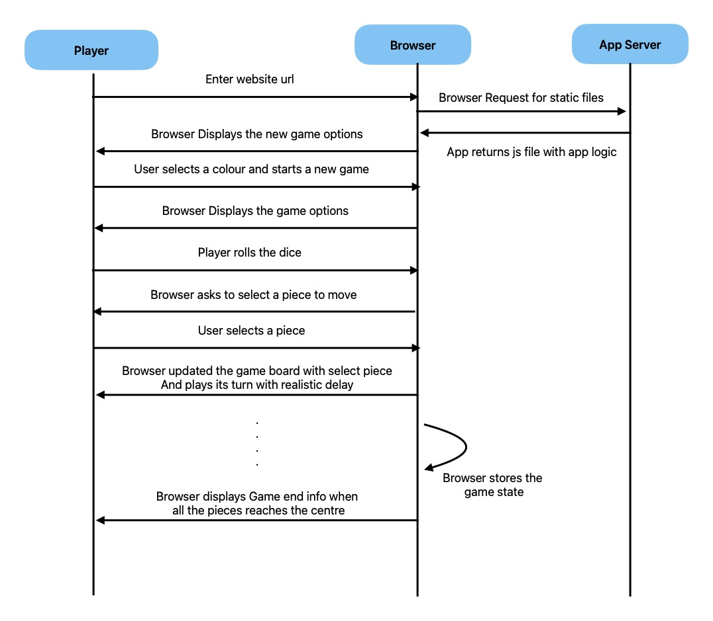

# Ludo game specifications

## What are we building?

We are building a web interface for famous Ludo game. It allows a user to play the game
against a bot.

## Why?

To gain end to end development experience of a website.

## Phase 1

### Function Requirements

- Allow user to play a game of ludo with bot
- Ensure dice rolls are true random
- User should be able to start a game anytime.

### Non-functional requirements

- Responsiveness

### User Story

1. two player: adding four player adds more complication for the initial phase.
1. Game is played between user vs computer.
1. Player can choose any color out of red, green, purple, yellow.
1. Players will start from opposite sides
1. every player will roll the dice alternatively
1. Once dice is rolled, user can select which piece to move
1. Player piece will move same steps as the number on the dice rolled.

### Architecture

1. Game logic will be implemented in Javascript and execute directly in the browser
1. Game state will be stored in localstorage to save the game state across different tabs
1. Use Reactjs to make it reactive
1. Use Nodejs to serve the app

### Sequence Diagram

